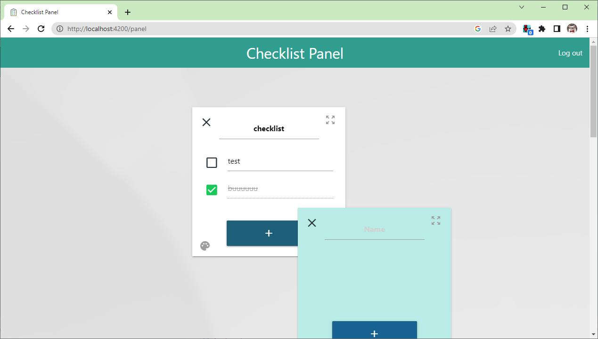

# AngularFire Checklist 

The project was created to present an example usage of:
* [AngularFire (Firebase) with Firestore DB](https://github.com/angular/angularfire) 
* [NgRX](https://ngrx.io/) 
* [MaterializeCSS](https://github.com/materializecss/materialize) 
* [SuitCSS](https://suitcss.github.io/) naming convention
* Component tests with mocks usage
* Simple angular animations
* Directives (as example I created one responsible for resizing a checklist)

## Application
App is hosted on Firestore: [https://todo-e5aa8.firebaseapp.com/panel](https://todo-e5aa8.firebaseapp.com/panel)

The application is a simple checklist app to which you can log in using email/password or Google SSO.  
Checklist added to the panel can be moved around, resized, and its color and name can be changed. You can also check/uncheck tasks; the task is removed after you delete its text. 

## Technical details
The app is build around state managed by NgRX, which is in constant correspondence with Firebase. The change made by the user firstly triggers the change in DB, then DB generates event to which subscribe is part of code which updates NgRX store; components watch NgRX and updated themselves.

Routing is based on lazy loaded modules.

Karma is cofigure to check test coverage. Tests use stubs to mock component depedencies

<a target="_blank" href="https://icons8.com/icon/kuWcoEOffWEU/clipboard">Clipboard</a> icon by <a target="_blank" href="https://icons8.com">Icons8</a>
